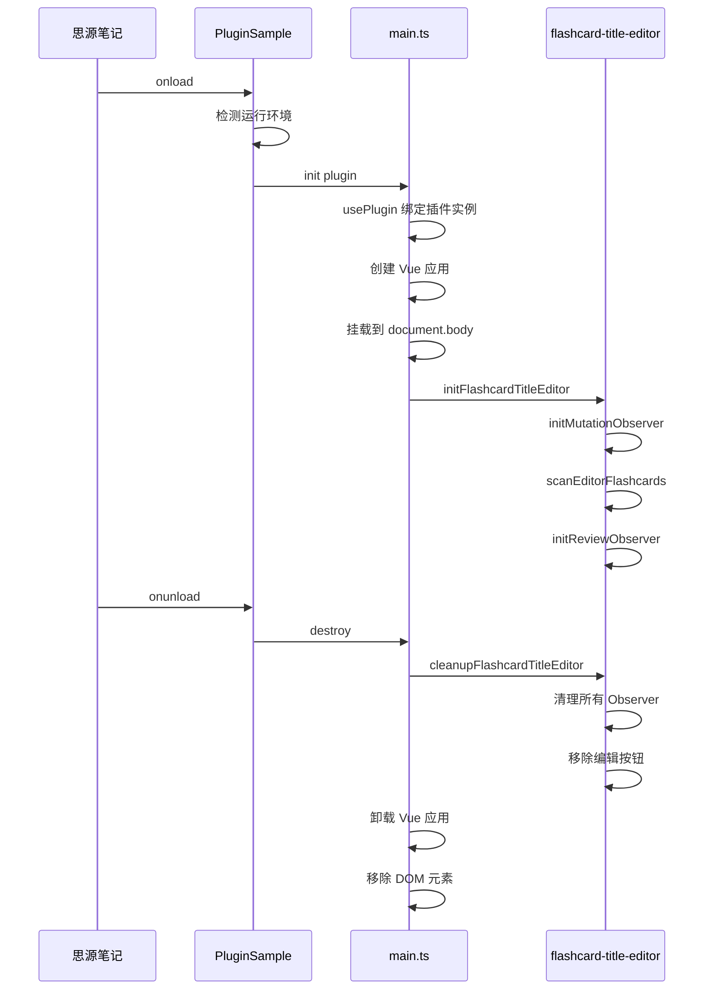
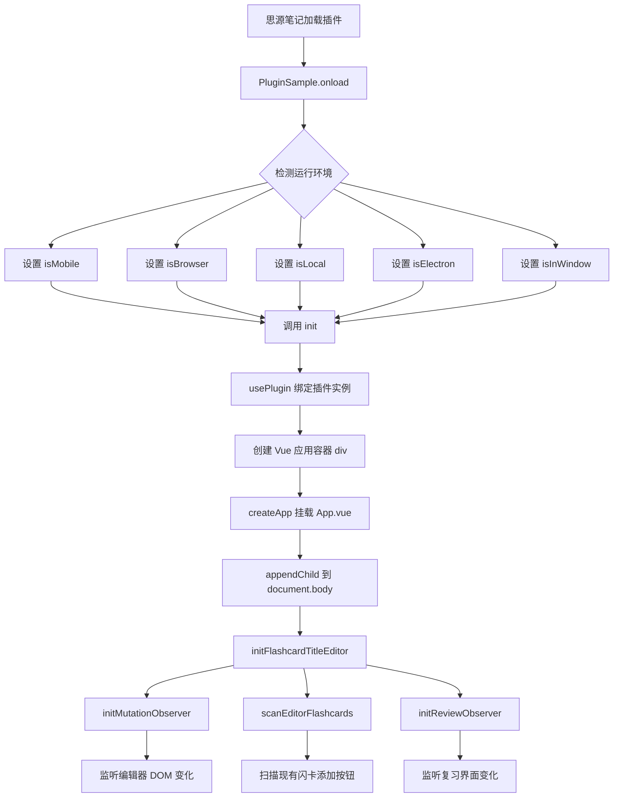

# 核心初始化流程

## 1. 插件生命周期



## 2. 入口文件分析

### 2.1 [`src/index.ts`](src/index.ts)

这是插件的入口类，继承自思源插件基类 `Plugin`。

```typescript
export default class PluginSample extends Plugin {
  // 环境标识
  public isMobile: boolean      // 移动端
  public isBrowser: boolean     // 浏览器环境
  public isLocal: boolean       // 本地环境
  public isElectron: boolean    // Electron 环境
  public isInWindow: boolean    // 独立窗口
  public platform: SyFrontendTypes
  
  // 插件加载时调用
  async onload() {
    // 1. 获取前端类型
    const frontEnd = getFrontend();
    
    // 2. 设置环境标识
    this.isMobile = frontEnd === "mobile" || frontEnd === "browser-mobile"
    this.isBrowser = frontEnd.includes('browser')
    this.isLocal = location.href.includes('127.0.0.1') || 
                   location.href.includes('localhost')
    this.isInWindow = location.href.includes('window.html')
    
    // 3. 检测 Electron 环境
    try {
      require("@electron/remote").require("@electron/remote/main")
      this.isElectron = true
    } catch (err) {
      this.isElectron = false
    }
    
    // 4. 初始化核心功能
    init(this)
  }

  // 插件卸载时调用
  onunload() {
    destroy()
  }

  // 打开设置面板
  openSetting() {
    window._sy_plugin_sample.openSetting()
  }
}
```

### 2.2 [`src/main.ts`](src/main.ts)

核心初始化逻辑，负责 Vue 应用创建和功能模块初始化。

```typescript
let plugin = null
let app = null
let appDiv: HTMLDivElement | null = null

// 插件实例访问器
export function usePlugin(pluginProps?: Plugin): Plugin {
  if (pluginProps) {
    plugin = pluginProps
  }
  return plugin
}

// 初始化函数
export function init(plugin: Plugin) {
  // 1. 绑定插件实例
  usePlugin(plugin);

  // 2. 创建并挂载 Vue 应用
  appDiv = document.createElement('div');
  appDiv.classList.add('sy-flashcard-toolbox-plugin-app');
  appDiv.id = 'sy-flashcard-toolbox-plugin-app';
  app = createApp(App);
  app.mount(appDiv);
  document.body.appendChild(appDiv);

  // 3. 初始化闪卡标题编辑器功能
  initFlashcardTitleEditor(plugin);
}

// 销毁函数
export function destroy() {
  // 1. 清理闪卡标题编辑器资源
  cleanupFlashcardTitleEditor();

  // 2. 卸载 Vue 应用
  if (app) {
    app.unmount();
    app = null;
  }

  // 3. 移除 DOM 元素
  if (appDiv && appDiv.parentNode) {
    appDiv.parentNode.removeChild(appDiv);
    appDiv = null;
  }
}
```

## 3. 初始化流程图



## 4. 关键时序

| 阶段 | 延迟 | 说明 |
|------|------|------|
| 功能初始化 | 1000ms | 延迟初始化 MutationObserver，确保思源 UI 完全加载 |
| 标题替换 | 100ms | 闪卡元素检测后延迟替换标题，等待 DOM 渲染完成 |
| 标签切换扫描 | 200ms | 标签切换后延迟扫描，等待内容加载 |

## 5. 环境检测逻辑

```mermaid
flowchart TD
    A[getFrontend] --> B{判断前端类型}
    B -->|mobile 或 browser-mobile| C[isMobile = true]
    B -->|包含 browser| D[isBrowser = true]
    B -->|其他| E[桌面环境]
    
    F[location.href] --> G{判断本地环境}
    G -->|包含 127.0.0.1| H[isLocal = true]
    G -->|包含 localhost| H
    G -->|其他| I[isLocal = false]
    
    J[location.href] --> K{判断窗口类型}
    K -->|包含 window.html| L[isInWindow = true]
    K -->|其他| M[isInWindow = false]
    
    N[try require electron/remote] --> O{成功?}
    O -->|是| P[isElectron = true]
    O -->|否| Q[isElectron = false]