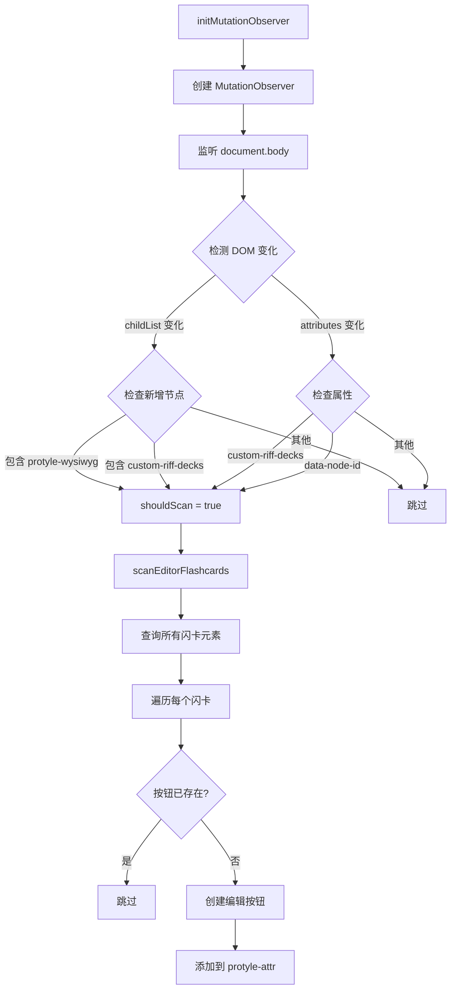
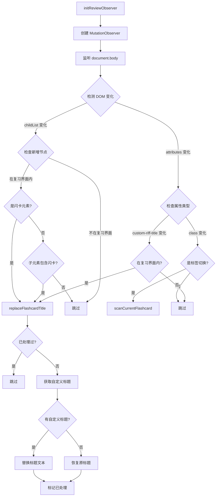

# 闪卡标题编辑器模块

## 1. 模块概述

闪卡标题编辑器是本插件的核心功能模块，位于 [`src/features/flashcard-title-editor/`](src/features/flashcard-title-editor/) 目录。该模块提供两个主要功能：

1. **编辑器视图功能**：在编辑器中为闪卡添加编辑按钮，允许用户设置自定义标题
2. **复习界面功能**：在复习闪卡时自动将原标题替换为自定义标题

## 2. 模块结构

```
flashcard-title-editor/
├── index.ts      # 主入口，包含所有核心逻辑
├── constants.ts  # 常量定义
├── utils.ts      # 工具函数
├── dialog.vue    # 对话框组件（未使用）
└── export.ts     # 导出功能（未使用）
```

## 3. 核心常量定义

### 3.1 选择器和属性

| 常量名 | 值 | 说明 |
|--------|-----|------|
| `FLASHCARD_SELECTOR` | `[custom-riff-decks]` | 闪卡元素选择器 |
| `FLASHCARD_TITLE_ATTR` | `custom-riff-title` | 自定义标题属性名 |
| `TITLE_REPLACED_FLAG` | `data-title-replaced` | 已替换标记属性 |

### 3.2 界面标识

| 常量名 | 值 | 说明 |
|--------|-----|------|
| `REVIEW_INTERFACE_ATTR` | `data-key` | 复习界面标识属性 |
| `REVIEW_INTERFACE_VALUE` | `dialog-opencard` | 复习界面标识值 |
| `HEADING_TYPE` | `NodeHeading` | 标题节点类型 |

## 4. 编辑器视图功能

### 4.1 流程图



### 4.2 关键函数

#### [`scanEditorFlashcards()`](src/features/flashcard-title-editor/index.ts:86)

扫描编辑器中的所有闪卡，为每个闪卡添加编辑按钮。

```typescript
const scanEditorFlashcards = () => {
  // 1. 查询所有闪卡元素
  const cardElements = document.querySelectorAll<HTMLElement>(FLASHCARD_SELECTOR);
  
  cardElements.forEach((cardElement) => {
    // 2. 获取块 ID
    const blockId = cardElement.getAttribute('data-node-id');
    if (!blockId) return;

    // 3. 找到控制栏容器
    const allProtyleAttrs = cardElement.querySelectorAll<HTMLElement>(':scope > .protyle-attr');
    if (allProtyleAttrs.length === 0) return;
    
    const protyleAttr = allProtyleAttrs[allProtyleAttrs.length - 1];
    
    // 4. 检查按钮是否已存在
    if (protyleAttr.querySelector(`.${EDIT_BUTTON_CLASS}`)) return;

    // 5. 创建并添加按钮
    const editButton = createEditButton(blockId);
    protyleAttr.appendChild(editButton);
  });
};
```

#### [`openEditDialog(blockId)`](src/features/flashcard-title-editor/index.ts:336)

打开编辑对话框，允许用户修改闪卡的自定义标题。

```typescript
const openEditDialog = async (blockId: string) => {
  // 1. 获取当前标题
  const attrs = await getBlockAttrs(blockId);
  let inputTitle = attrs[FLASHCARD_TITLE_ATTR] || '';

  // 2. 创建对话框
  currentDialog = new Dialog({
    title: DIALOG_TITLE,
    content: `...输入框和按钮...`,
    width: isMobile ? '90vw' : '400px',
  });

  // 3. 绑定保存事件
  const handleSave = async () => {
    const title = filterInvalidChars(inputEl.value);
    await setBlockAttrs(blockId, { [FLASHCARD_TITLE_ATTR]: title });
    showSiyuanMsg(TIP_SAVE_SUCCESS, 'success');
    currentDialog?.destroy();
  };

  // 4. 绑定取消事件
  cancelBtn?.addEventListener('click', () => currentDialog?.destroy());
};
```

## 5. 复习界面功能

### 5.1 流程图



### 5.2 关键函数

#### [`replaceFlashcardTitle(cardElement)`](src/features/flashcard-title-editor/index.ts:116)

替换复习界面中闪卡的标题。

```typescript
const replaceFlashcardTitle = async (cardElement: HTMLElement) => {
  // 1. 检查是否已处理
  if (cardElement.hasAttribute(TITLE_REPLACED_FLAG)) return;
  
  // 2. 获取自定义标题
  const customTitle = getCustomTitle(cardElement);
  
  // 3. 获取第一个子元素（排除 protyle-attr）
  const firstChild = cardElement.querySelector<HTMLElement>(':scope > div:not(.protyle-attr)');
  
  if (!firstChild || !isHeadingElement(firstChild)) return;
  
  // 4. 获取标题文本元素
  const textElement = getHeadingTextElement(firstChild);
  if (!textElement) return;
  
  // 5. 替换或恢复标题
  if (!customTitle) {
    // 恢复原标题
    const headingBlockId = firstChild.getAttribute('data-node-id');
    const block = await getBlockByID(headingBlockId);
    if (block && block.content) {
      textElement.textContent = block.content;
    }
  } else {
    // 替换为自定义标题
    textElement.textContent = customTitle;
  }
  
  // 6. 标记已处理
  cardElement.setAttribute(TITLE_REPLACED_FLAG, 'true');
};
```

#### [`isElementInReviewInterface(element)`](src/features/flashcard-title-editor/index.ts:193)

判断元素是否在复习界面内。

```typescript
const isElementInReviewInterface = (element: HTMLElement): boolean => {
  let parent = element.parentElement;
  while (parent) {
    if (parent.getAttribute('data-key') === 'dialog-opencard') {
      return true;
    }
    parent = parent.parentElement;
  }
  return false;
};
```

## 6. 数据流

```mermaid
flowchart LR
    subgraph 编辑器视图
        A[用户点击编辑按钮] --> B[openEditDialog]
        B --> C[输入自定义标题]
        C --> D[handleSave]
        D --> E[setBlockAttrs API]
        E --> F[保存 custom-riff-title 属性]
    end
    
    subgraph 复习界面
        G[打开复习界面] --> H[initReviewObserver 检测]
        H --> I[发现闪卡元素]
        I --> J[replaceFlashcardTitle]
        J --> K[getBlockAttrs API]
        K --> L[读取 custom-riff-title]
        L --> M[替换标题文本]
    end
    
    F -.-> G
```



## 7. Observer 管理

### 7.1 三个 MutationObserver

| Observer | 监听目标 | 用途 |
|----------|----------|------|
| `editorObserver` | `document.body` | 监听编辑器中闪卡元素的添加/修改 |
| `reviewObserver` | `document.body` | 监听复习界面中闪卡的变化 |
| `observer` | 未使用 | 预留 |

### 7.2 监听配置

```typescript
// 编辑器 Observer 配置
editorObserver.observe(document.body, {
  childList: true,
  subtree: true,
  attributes: true,
  attributeFilter: ['custom-riff-decks', 'data-node-id']
});

// 复习界面 Observer 配置
reviewObserver.observe(document.body, {
  childList: true,
  subtree: true,
  attributes: true,
  attributeFilter: ['custom-riff-title', 'class']
});
```

## 8. 清理函数

[`cleanup()`](src/features/flashcard-title-editor/index.ts:415) 函数在插件卸载时调用：

```typescript
export const cleanup = () => {
  // 1. 断开所有 Observer
  observer?.disconnect();
  editorObserver?.disconnect();
  reviewObserver?.disconnect();

  // 2. 销毁对话框
  if (currentDialog) {
    currentDialog.destroy();
  }

  // 3. 移除所有编辑按钮
  document.querySelectorAll(`.${EDIT_BUTTON_CLASS}`).forEach((btn) => btn.remove());
  
  // 4. 移除已替换标记
  document.querySelectorAll(`[${TITLE_REPLACED_FLAG}]`).forEach((el) => {
    el.removeAttribute(TITLE_REPLACED_FLAG);
  });
};