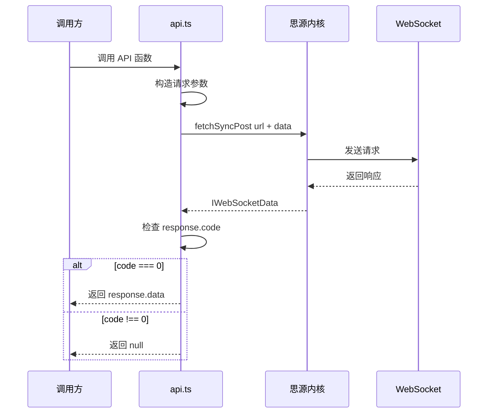
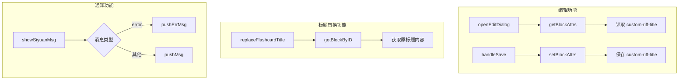

# API 封装层

## 1. 概述

[`src/api.ts`](src/api.ts) 文件封装了思源笔记的内核 API，提供类型安全的 TypeScript 接口。该文件基于 [sy-plugin-template-vite](https://github.com/frostime/sy-plugin-template-vite) 模板。

## 2. 核心请求函数

### 2.1 [`request()`](src/api.ts:11)

所有 API 调用的基础函数。

```typescript
async function request(url: string, data: any) {
  let response: IWebSocketData = await fetchSyncPost(url, data);
  let res = response.code === 0 ? response.data : null;
  return res;
}
```

### 2.2 请求流程



## 3. API 分类

### 3.1 笔记本 API

| 函数 | 端点 | 说明 |
|------|------|------|
| [`lsNotebooks()`](src/api.ts:19) | `/api/notebook/lsNotebooks` | 获取笔记本列表 |
| [`openNotebook(notebook)`](src/api.ts:24) | `/api/notebook/openNotebook` | 打开笔记本 |
| [`closeNotebook(notebook)`](src/api.ts:29) | `/api/notebook/closeNotebook` | 关闭笔记本 |
| [`renameNotebook(notebook, name)`](src/api.ts:34) | `/api/notebook/renameNotebook` | 重命名笔记本 |
| [`createNotebook(name)`](src/api.ts:39) | `/api/notebook/createNotebook` | 创建笔记本 |
| [`removeNotebook(notebook)`](src/api.ts:44) | `/api/notebook/removeNotebook` | 删除笔记本 |
| [`getNotebookConf(notebook)`](src/api.ts:49) | `/api/notebook/getNotebookConf` | 获取笔记本配置 |
| [`setNotebookConf(notebook, conf)`](src/api.ts:57) | `/api/notebook/setNotebookConf` | 设置笔记本配置 |

### 3.2 文件树 API

| 函数 | 端点 | 说明 |
|------|------|------|
| [`createDocWithMd(notebook, path, markdown)`](src/api.ts:67) | `/api/filetree/createDocWithMd` | 用 Markdown 创建文档 |
| [`renameDoc(notebook, path, title)`](src/api.ts:81) | `/api/filetree/renameDoc` | 重命名文档 |
| [`removeDoc(notebook, path)`](src/api.ts:95) | `/api/filetree/removeDoc` | 删除文档 |
| [`moveDocs(fromPaths, toNotebook, toPath)`](src/api.ts:104) | `/api/filetree/moveDocs` | 移动文档 |
| [`getHPathByPath(notebook, path)`](src/api.ts:118) | `/api/filetree/getHPathByPath` | 获取人类可读路径 |
| [`getHPathByID(id)`](src/api.ts:130) | `/api/filetree/getHPathByID` | 通过 ID 获取路径 |
| [`getIDsByHPath(notebook, path)`](src/api.ts:138) | `/api/filetree/getIDsByHPath` | 通过路径获取 ID |

### 3.3 块操作 API

| 函数 | 端点 | 说明 |
|------|------|------|
| [`insertBlock(dataType, data, ...)`](src/api.ts:167) | `/api/block/insertBlock` | 插入块 |
| [`prependBlock(dataType, data, parentID)`](src/api.ts:185) | `/api/block/prependBlock` | 在开头插入块 |
| [`appendBlock(dataType, data, parentID)`](src/api.ts:199) | `/api/block/appendBlock` | 在末尾插入块 |
| [`updateBlock(dataType, data, id)`](src/api.ts:213) | `/api/block/updateBlock` | 更新块 |
| [`deleteBlock(id)`](src/api.ts:227) | `/api/block/deleteBlock` | 删除块 |
| [`moveBlock(id, previousID, parentID)`](src/api.ts:235) | `/api/block/moveBlock` | 移动块 |
| [`getBlockKramdown(id)`](src/api.ts:249) | `/api/block/getBlockKramdown` | 获取块 Kramdown |
| [`getChildBlocks(id)`](src/api.ts:259) | `/api/block/getChildBlocks` | 获取子块 |
| [`transferBlockRef(fromID, toID, refIDs)`](src/api.ts:269) | `/api/block/transferBlockRef` | 转移块引用 |

### 3.4 属性 API（本插件核心使用）

| 函数 | 端点 | 说明 |
|------|------|------|
| [`setBlockAttrs(id, attrs)`](src/api.ts:284) | `/api/attr/setBlockAttrs` | 设置块属性 |
| [`getBlockAttrs(id)`](src/api.ts:296) | `/api/attr/getBlockAttrs` | 获取块属性 |

**使用示例：**

```typescript
// 设置闪卡自定义标题
await setBlockAttrs(blockId, { 'custom-riff-title': '新标题' });

// 获取闪卡属性
const attrs = await getBlockAttrs(blockId);
const customTitle = attrs['custom-riff-title'];
```

### 3.5 SQL 查询 API

| 函数 | 端点 | 说明 |
|------|------|------|
| [`sql(sql)`](src/api.ts:308) | `/api/query/sql` | 执行 SQL 查询 |
| [`getBlockByID(blockId)`](src/api.ts:316) | 封装 | 通过 ID 获取块信息 |

**使用示例：**

```typescript
// 获取块信息
const block = await getBlockByID('20231201-abc123');
console.log(block.content); // 块内容
```

### 3.6 文件 API

| 函数 | 端点 | 说明 |
|------|------|------|
| [`getFile(path)`](src/api.ts:343) | `/api/file/getFile` | 获取文件 |
| [`putFile(path, isDir, file)`](src/api.ts:356) | `/api/file/putFile` | 写入文件 |
| [`removeFile(path)`](src/api.ts:368) | `/api/file/removeFile` | 删除文件 |
| [`readDir(path)`](src/api.ts:376) | `/api/file/readDir` | 读取目录 |

### 3.7 通知 API

| 函数 | 端点 | 说明 |
|------|------|------|
| [`pushMsg(msg, timeout)`](src/api.ts:426) | `/api/notification/pushMsg` | 推送普通消息 |
| [`pushErrMsg(msg, timeout)`](src/api.ts:435) | `/api/notification/pushErrMsg` | 推送错误消息 |

**使用示例：**

```typescript
// 显示成功消息
pushMsg('保存成功', 2000);

// 显示错误消息
pushErrMsg('操作失败', 2000);
```

### 3.8 系统 API

| 函数 | 端点 | 说明 |
|------|------|------|
| [`bootProgress()`](src/api.ts:467) | `/api/system/bootProgress` | 获取启动进度 |
| [`version()`](src/api.ts:471) | `/api/system/version` | 获取版本号 |
| [`currentTime()`](src/api.ts:475) | `/api/system/currentTime` | 获取当前时间 |

## 4. 本插件使用的 API



## 5. 类型定义

API 相关的类型定义位于 [`src/types/api.d.ts`](src/types/api.d.ts) 和 [`src/types/index.d.ts`](src/types/index.d.ts)。

### 5.1 基础类型

```typescript
type DocumentId = string;  // 文档 ID
type BlockId = string;     // 块 ID
type NotebookId = string;  // 笔记本 ID
```

### 5.2 Block 类型

```typescript
type Block = {
  id: BlockId;
  parent_id?: BlockId;
  root_id: DocumentId;
  content: string;      // 块内容
  markdown: string;     // Markdown 源码
  type: BlockType;      // 块类型
  subtype: BlockSubType;
  // ... 其他属性
};
```

## 6. 错误处理

所有 API 调用都通过 `request()` 函数统一处理错误：

- 当 `response.code === 0` 时返回 `response.data`
- 否则返回 `null`

调用方需要检查返回值是否为 `null` 来判断调用是否成功。