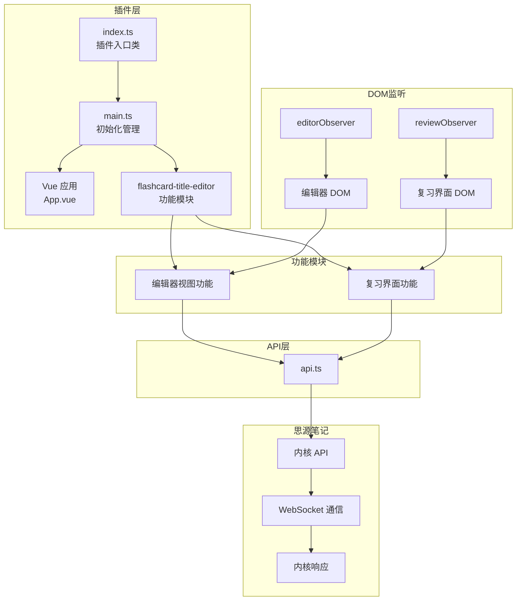
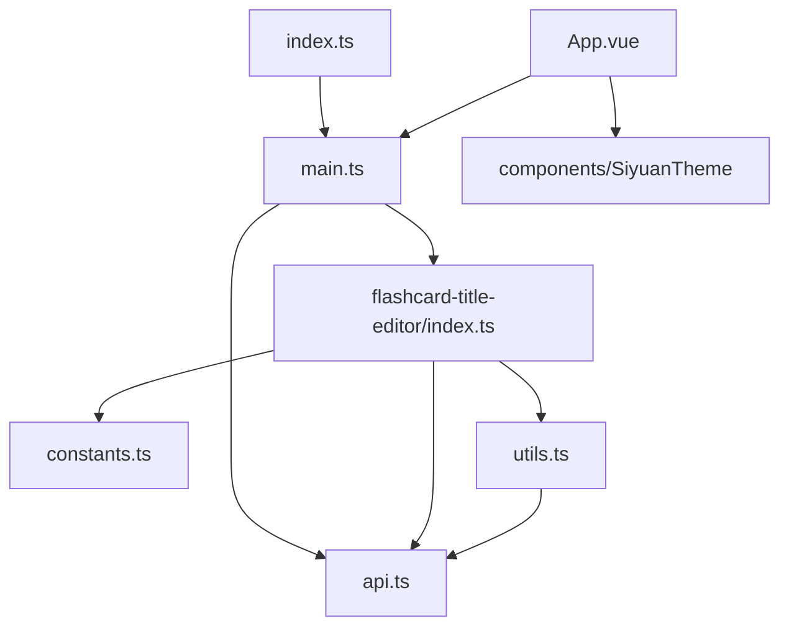
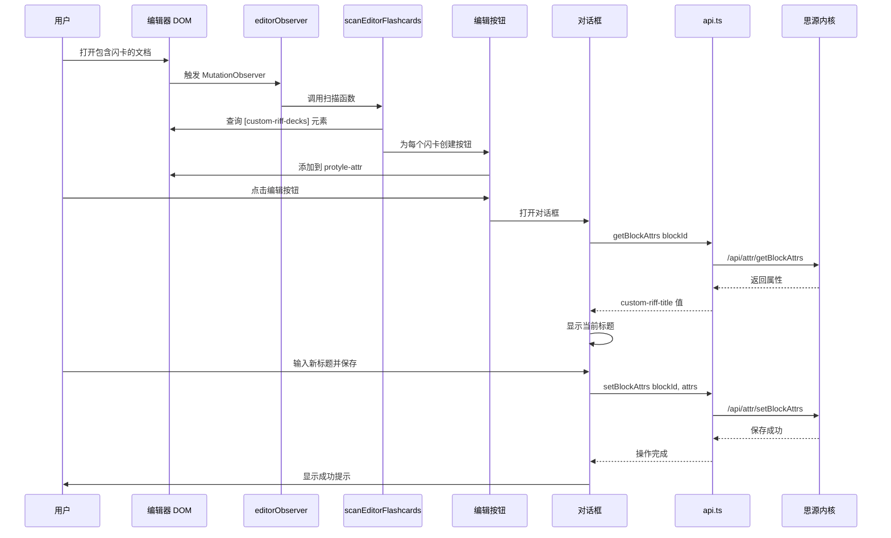
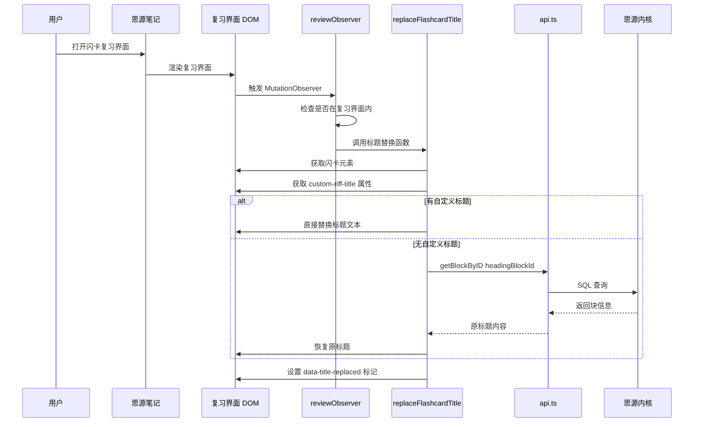
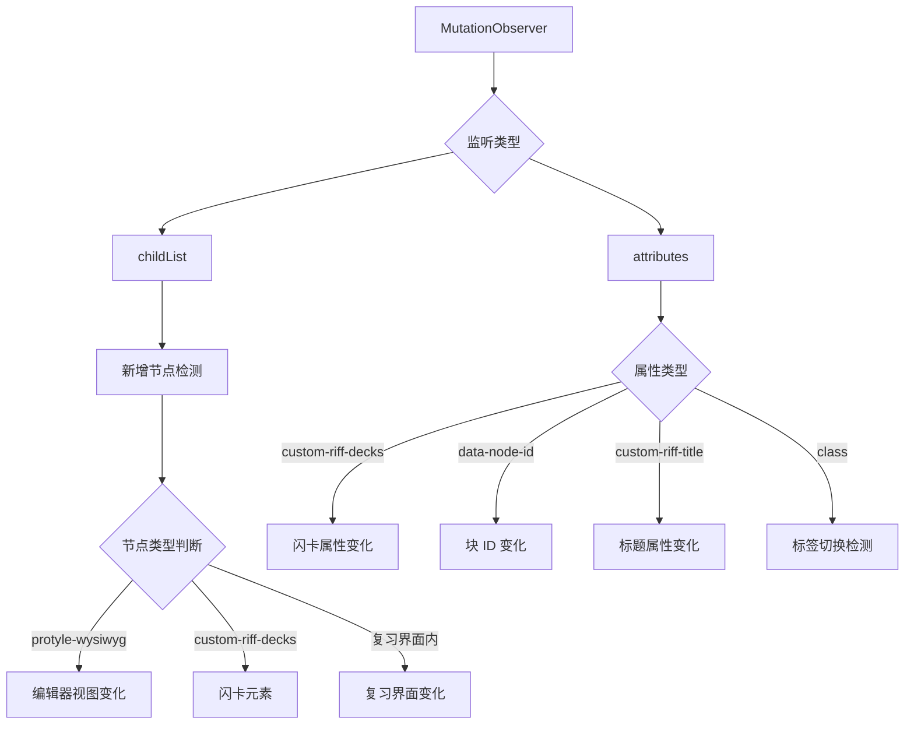
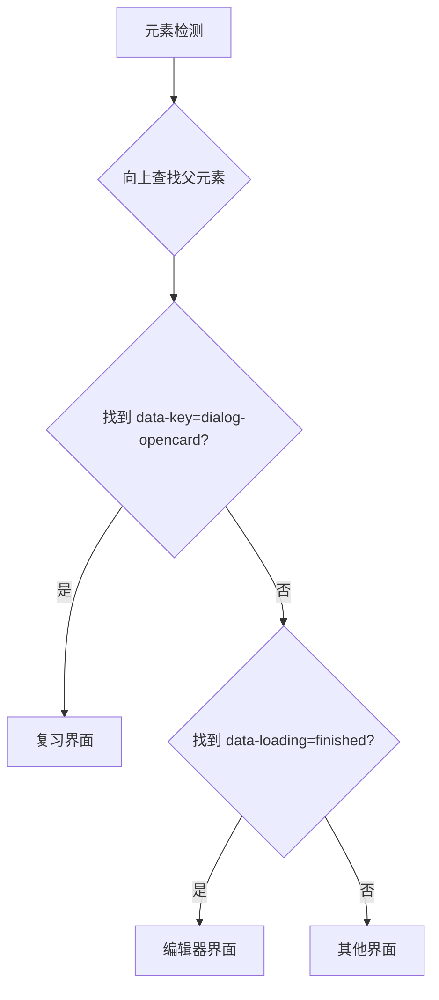
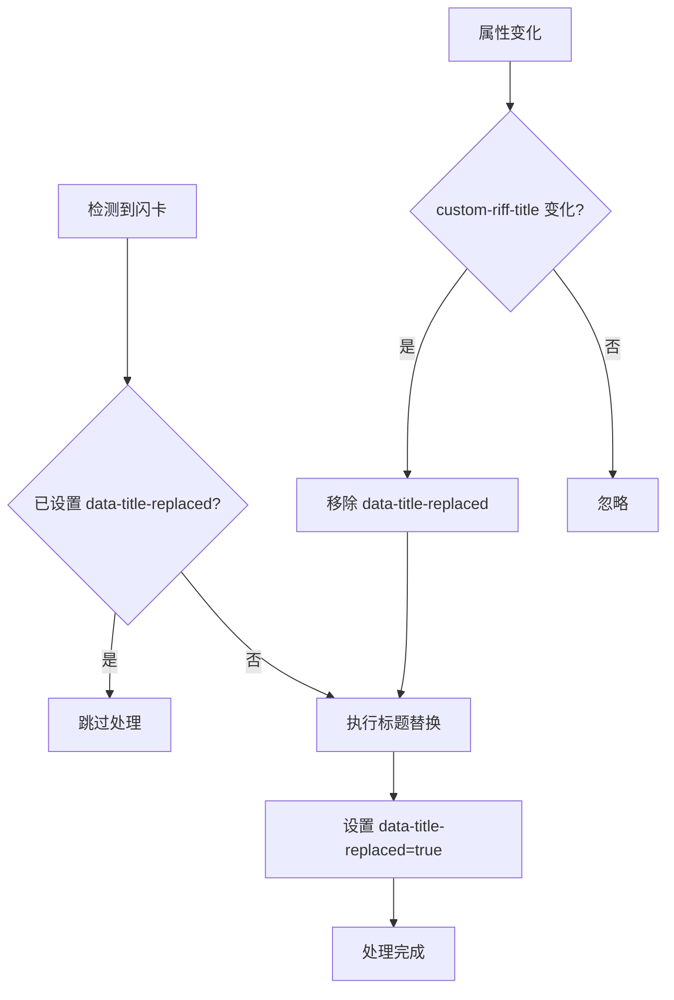
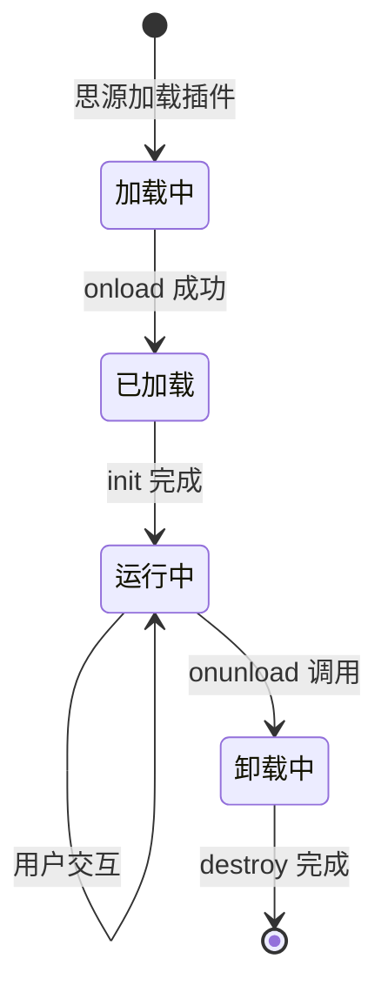

# 整体架构与数据流

## 1. 系统架构图

## 2. 模块依赖关系

## 3. 完整数据流程

### 3.1 编辑自定义标题流程

### 3.2 复习界面标题替换流程

## 4. 关键技术点

### 4.1 MutationObserver 监听策略

### 4.2 界面判断逻辑

### 4.3 标题替换防重复机制

## 5. 插件生命周期

## 6. 文件职责总结

| 文件 | 职责 |
|------|------|
| [`src/index.ts`](src/index.ts) | 插件入口类，生命周期管理，环境检测 |
| [`src/main.ts`](src/main.ts) | Vue 应用管理，功能模块初始化/清理 |
| [`src/api.ts`](src/api.ts) | 思源内核 API 封装 |
| [`src/App.vue`](src/App.vue) | Vue 根组件（演示用途） |
| [`src/features/flashcard-title-editor/index.ts`](src/features/flashcard-title-editor/index.ts) | 核心功能实现 |
| [`src/features/flashcard-title-editor/constants.ts`](src/features/flashcard-title-editor/constants.ts) | 常量定义 |
| [`src/features/flashcard-title-editor/utils.ts`](src/features/flashcard-title-editor/utils.ts) | 工具函数 |
| [`plugin.json`](plugin.json) | 插件元数据配置 |

## 7. 扩展建议

### 7.1 当前架构优势
- 模块化设计，功能独立
- 使用 MutationObserver 实现无侵入式监听
- API 层封装良好，易于维护

### 7.2 潜在改进点
1. **状态管理**：可引入 Pinia 进行全局状态管理
2. **配置持久化**：添加插件配置存储功能
3. **国际化完善**：补充更多语言支持
4. **错误边界**：添加更完善的错误处理机制